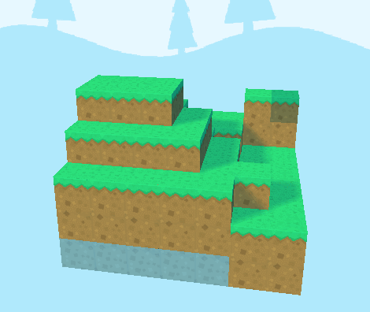

# superpowers-game-noisejs-plugin
[Noisejs](https://github.com/josephg/noisejs) plugin for Superpowers Game.



## Installation on Windows
Use the following commands
```
cd %appdata%\Superpowers\systems\game\plugins\extra
git clone --recursive https://github.com/Pixelrobin/superpowers-game-noisejs-plugin noisejs
```
Currently not tested on mac or linux. If anyone is willing to share how to install on those platforms, please open a PR!

## Demo project
The repository contains a little demo project with minecraft-like terrain generation. Just copy the `noisejs-demo` folder from `project\demo.zip` to your superpowers project directory. Make sure you installed the plugin.

On Windows, in a typical installation, your projects folder is located under `%appdata%\Superpowers\projects` and if you followed the directions above, the plugin should be installed in `%appdata%\Superpowers\systems\game\plugins\extra\` as the folder `noisejs`.

## Usage
``` Typescript
// Set the seed of the noise ( float between 0 and 1 or integer between 1 and 65536 )
Noise.seed( seed: number ): void

// Make a random seed for the noise
Noise.makeRandomSeed(): void

// Get the last set seed
Noise.getSeed(): number

// Simplex Noise functions
Noise.simplex2d( x: number, y: number ): number            // 2D
Noise.simplex3d( x: number, y: number, z: number ): number // 3D
  
// Perlin Noise functions
Noise.perlin2d( x: number, y: number ): number            // 2D
Noise.perlin3d( x: number, y: number, z: number ): number // 3D
```

## Example
``` Typescript
// Taken and adapted from the original noisejs repo

let width = 10, height = 10, time = 0, values: number[] = [];
Noise.makeRandomSeed();

for (var x = 0; x < width; x ++) {
  for (var y = 0; y < height; y ++) {
    // All noise functions return values in the range of -1 to 1.

    // noise.simplex2 and noise.perlin2 for 2d noise
    let value = Noise.simplex2d(x / 100, y / 100);
    // ... or noise.simplex3 and noise.perlin3:
    let value = Noise.simplex3d(x / 100, y / 100, time);

    values[ x, y ] = value // Or whatever. See demo project for a minecraft-like terrain generator
    
  }
}
```

## License
This project is licensed under the [MIT License](https://github.com/Pixelrobin/superpowers-game-noisejs-plugin/blob/master/LICENSE).

It includes code from josephg/noisejs, which is licensed under the [ISC License](https://github.com/josephg/noisejs/blob/master/LICENSE)
